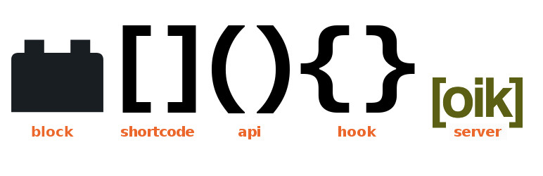

# oik shortcodes server 

* Contributors: bobbingwide
* Donate link: https://www.oik-plugins.com/oik/oik-donate/
* Tags: oik, fields, custom post types, shortcodes, APIs, hooks, [bw_api], [apis], [hooks], [codes]
* Requires at least: 5.2
* Tested up to: 6.4-RC3
* Gutenberg compatible: Yes
* Stable tag: 1.41.3
* License: GPLv2 or later
* License URI: http://www.gnu.org/licenses/gpl-2.0.html

## Description 
The oik shortcodes server is used to document and serve the help documentation for plugins and themes:

* lazy smart shortcodes
* oik APIs, classes and methods - documenting the public and private oik/bw Application Programming Interface
* hooks - the action and filter hooks that oik plugins Invoke or Implement
* blocks - for the WordPress block editor aka Gutenberg

It provides the following shortcodes:
* [bw_api] - automatically report the syntax for an API
* [api] - link to selected API(s)
* [apis] - link to related APIs (in a list)
* [blocks] - link to related Blocks
* [classes] - list of classes
* [codes] - link to related shortcodes
* [file] - display file contents
* [files] - list of files
* [hook] - link to selected hook(s)
* [hooks] - links to action / filter hooks
* [md] - markdown

It provides an admin page where APIs can be added
BUT is more useful when invoked using oik-batch, a WP-CLI like interface

In order for the Calls and Called by trees to be maintained you have to process each API twice.

Features
* Advanced shortcodes to display content
* Parsed APIs and files are stored to improve display performance.  (v1.22)
* Parses WordPress core, plugins and themes (v1.20)
* Pagination of long lists
* 'Compatible with Shortcake' checkbox?

New in version 1.41.0
* [blocks] shortcode supports link to block variations

New in version 1.39.0
* Supports Comments on Blocks and Block examples

New in version 1.38.0
* Supports block variations as children of the parent block

New in version 1.37.0

* Virtual field block_catalogued
* WordPress APIs are now cached in a JSON file

New in version 1.35.0

* Adds AJAX function to create a block post

New in version 1.34.0

* Adds Depends on field for Block and Block examples custom post types

New in version 1.31.0

* Adds support for WordPress Blocks and Block examples

New in version 1.22

* The first time that the API or file is parsed then a new post is created, with a link to the source post.
* The second parse will update the version, setting the _oik_parse_count field to the timestamp of the source file.
* Subsequent parses will only update the saved version if the source file has changed, or been touched.
* Display of APIs or files will check if the saved version is the latest.
* Note: Cached parsed output is currently NOT paginated.

New in version 1.20

* Support for themes, using on oik-themes server

New in version 1.19

* [files] shortcode to list files delivered by a plugin
* [file] shortcode for links to files
* [classes] shortcode to list classes implemented in a plugin
* Support for pagination of long lists

New in version 1.15

* Support for recording files in the "oik_file" CPT
* [file] shortcode to display the logic implemented in a file, ignoring classes, methods and APIs

New in version 1.10

* Support for classes and methods
* Reflection functions applied against dummy functions if not alreay loaded

New in version 1.08

* routines to dynamically register action and filter hooks.
* routines to associate APIs to hooks
* listing of Invokers and Implementers of actions and hooks

## Installation 
1. Upload the contents of the oik-shortcodes plugin to the `/wp-content/plugins/oik-shortcodes' directory
1. Activate the plugin through the 'Plugins' menu in WordPress
1. Define your content using wp-admin or the Ajax interface

## Frequently Asked Questions 
# Where is the FAQ? 
[oik FAQ](https://www.oik-plugins.com/oik/oik-faq)

# Can I get support? 
Yes - see above

## Screenshots 
1. Editing an oik_api - showing the API type select list
2. Editing an oik_shortcode

## Upgrade Notice 
# 1.41.3 
Upgrade for more changes for PHP 8.2 support.

## Changelog 
# 1.41.2 
* Changed: Update Copyright year #91
* Fixed: Correct latest_hd5_hash to latest_md5_hash #84
* Changed: Default description to '' not null #84
* Changed: Declare $handlers #91
* Tested: With WordPress 6.4-RC3 and WordPress Multisite
* Tested: With Gutenberg 16.9.0
* Tested: With PHP 8.0, PHP 8.1 and PHP 8.2
* Tested: With PHPUnit 9.6

## Further reading 
If you want to read more about the oik plugins then please visit the
[oik plugin](https://www.oik-plugins.com/oik)
**"the oik plugin - for often included key-information"**

For more information about the WordPress Code Reference

http://make.wordpress.org/docs/2013/03/07/better-wordpress-code-reference/

Where it's supposed to reside:

http://developer.wordpress.org/

How to document an action or filter hook:

http://make.wordpress.org/core/handbook/inline-documentation-standards/php-documentation-standards/#4-hooks-actions-and-filters

WP-parser:

https://github.com/rmccue/WP-Parser

Places where you can find Function reference material:

http://api.wordpress.org/core/handbook/1.0/?function=__return_true&version=3.6.1&locale=en_US&redirect=1
http://api.wordpress.org/core/handbook/1.0/?function=_return_true&version=3.6.1&locale=en_US&redirect=1

http://codex.wordpress.org/Function_Reference/_return_true

